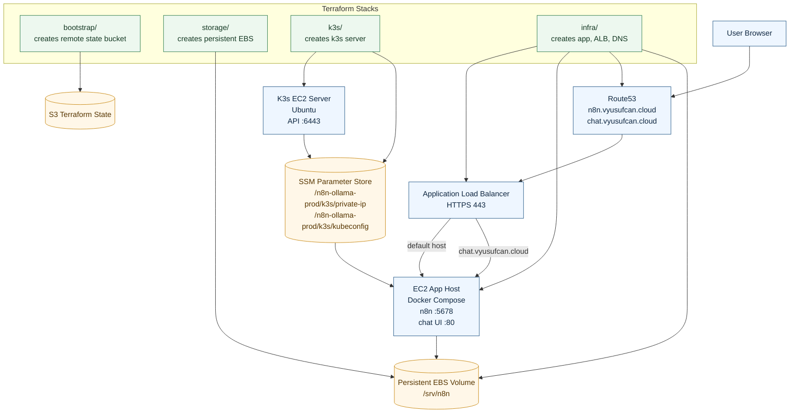

# n8n Infrastructure Diagram

This diagram reflects the current split-stack topology in this repository.

## Provisioning Order

1. `bootstrap/`
2. `storage/`
3. `k3s/`
4. `infra/`

## Key Notes

- `storage/` owns the persistent EBS volume and should survive app rebuilds.
- `k3s/` publishes its private IP and kubeconfig path into SSM.
- `infra/` reads the k3s private IP from SSM and permits app access from the k3s server.
- Public HTTPS traffic enters through the ALB and is routed to the app EC2 instance.
